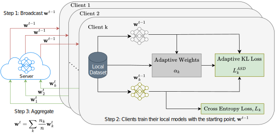

# Adaptive Self-Distillation for Minimizing Client Drift in Heterogeneous Federated Learning

<p align="center">
  
</p>

> [**Adaptive Self-Distillation for Minimizing Client Drift in Heterogeneous Federated Learning**](https://openreview.net/forum?id=K58n87DE4s)
> [M. Yashwanth](https://www.linkedin.com/in/yashwanth-mandula-aba700a5), [G. K. Nayak](https://sites.google.com/view/gauravnayak), [A. Singh](https://www.linkedin.com/in/aryasingh007), [Yogesh Simmhan](), [A. Chakraborty](https://anirbanchakraborty.github.io)<br>Indian Institute of Science, Visual Computing Lab

This repository contains the pytorch implementation for a novel Federated Learning (FL) regularization technique, Adaptive Self-Distillation (ASD). ASD addresses the "client-drift" problem in FL, where clients diverge towards local optima due to non-IID data distributions. By adaptively adjusting the regularization strength based on the global model's prediction entropy and client-data label distribution, ASD significantly improves the convergence speed and generalization performance of FL algorithms.

## :rocket: Main Results

### Top-1 accuracy

|Method|CIFAR-100|||Tiny-Imagenet|||
|:----:|:---:|:---:|:---:|:---:| :---: |:---:|
||$\delta$ = 0.3|$\delta$ = 0.6|IID|$\delta$ = 0.3|$\delta$ = 0.6|IID|
|FedAvg|38.67|38.53|37.68|23.89|23.95|23.48|
|FedAvg+ASD (ours)|42.77|42.54|43.00|25.31|26.38|26.67|
|FedDyn|47.56|48.60|48.87|27.62|28.58|28.37|
|FedDyn+ASD (ours)|49.03|50.23|51.44|29.94|30.05|30.76|
|FedSpeed|47.39|48.27|49.01|28.60|29.33|29.62|
|FedSpeed+ASD (ours)|49.16|49.76|51.99|30.97|30.05|32.68|

Note: Find results for other methods in **Table 2** of the paper.

### Ablation Results

#### Effect of Adaptive Weights on Distillation (CIFAR-100)

|Method|Uniform weights|Adaptive weights|
|:---:|:---:|:---:|
|FedAvg+ASD|41.75|42.77|
|FedNTD+ASD|40.40|43.01|
|FedDisco+ASD|40.21|41.55|
|FedDyn+ASD|47.90|49.03|

## :hammer: Setup

- CIFAR datasets are downloaded using torchvision.
- Imagenet-100 dataset is downloaded from [here](https://www.kaggle.com/datasets/ambityga/imagenet100) and reorganized into train and test folders.
- To prepare dataloader pickle files:
Run command ```python tiny_imagenet.py <path_to_dataset_folder>```. Change the degree of heterogeneity (```rule_arg```) and pickle output filename in the code.
- All the experiments should be configured using **config.yml**.
- To restart from a saved checkpoint: add ```--use_checkpoint 1``` and ```--restart_round <round>``` to the command or configure these parameters in config.yml.

## :test_tube: Running Experiments

- Run ```python main.py``` to train FedAvg algorithm on CIFAR-100 dataset across 100 clients for 500 rounds with the following setting:
```
dataset_name: CIFAR100
alg_name: FedAvg
n_client: 100
com_amount: 500
add_reg: 0 // To add ASD regularizer
dist_beta_kl: 1.0 // hyperparameter for the label imbalance loss
lamda: 0.0 // hyperparameter for regularizer
data_pkl: dir_0.3_cifar100_data.pkl // path to dataloader pickle file
use_checkpoint: 0 // or 1 if starting from a saved model checkpoint
restart_round: <restart_round> // restart from this round
```

- To add SAM/ASAM optimizer for FedSAM/FedASAM, use ```sam: 1``` or ```asam: 1``` accordingly.
- To run FedNTD, keep the settings as such:
```
alg_name: FedAvgReg
ntd: 1
uniform_distill: 1 // Change it to 0 to add the ASD regularizer on top of FedNTD
```
Note: **add_reg** should not be used to distinguish between FedAvg and FedAvg+ASD. Use **FedAvgReg** to add ASD regularizer in FedAvg.
- To run FedDisco: keep ```alg_name FedAvg``` and use ```disco: 1``` in the config file. Use ```alg_name FedAvgReg``` to add ASD regularizer in FedDisco.

*\*Raise an issue if unable to run any experiment\**

## :+1: Acknowledgement

This project is built upon the codebase of [FedDyn](https://github.com/alpemreacar/FedDyn). Thanks to all the contributors of this work. We would also like to acknowledge the work of [Wu et al. (2022)](https://www.ecva.net/papers/eccv_2022/papers_ECCV/papers/136810068.pdf) for providing the foundational model architecture of Tiny-VIT.

## :pencil: Citation

If you think this project is helpful, please feel free to cite our paper:

```
@article{
  yashwanth2024adaptive,
  title={Adaptive Self-Distillation for Minimizing Client Drift in Heterogeneous Federated Learning},
  author={M Yashwanth and Gaurav Kumar Nayak and Arya Singh and Yogesh Simmhan and Anirban Chakraborty},
  journal={Transactions on Machine Learning Research},
  issn={2835-8856},
  year={2024},
  url={https://openreview.net/forum?id=K58n87DE4s},
}
```